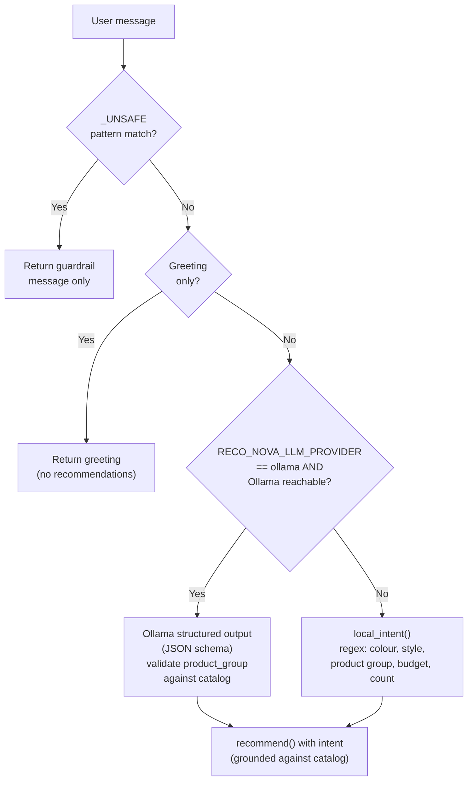
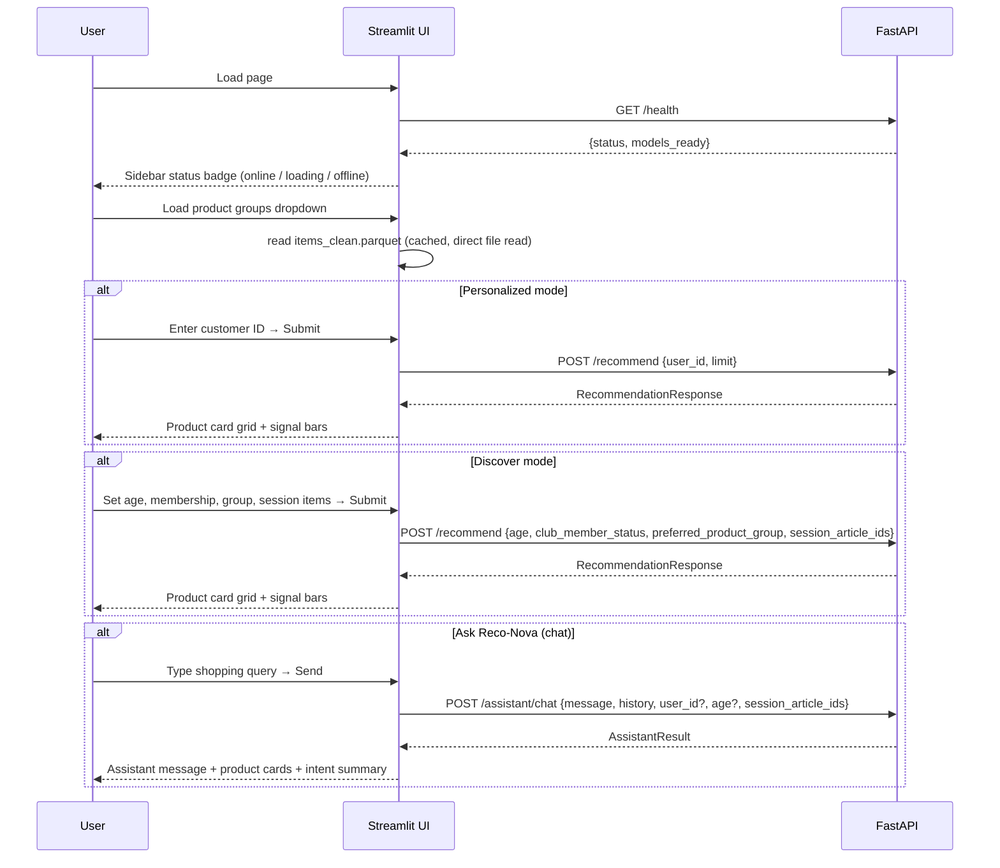

# API and UI Interaction Points

## Endpoints

| Method | Path | Purpose | Auth |
|---|---|---|---|
| `GET` | `/` | Discoverability (name, health link, docs link) | None |
| `GET` | `/health` | Model readiness check | None |
| `POST` | `/recommend` | Personalized or cold-start recommendations | None |
| `POST` | `/explain` | Same as `/recommend`; semantically distinct for explainability-focused clients | None |
| `POST` | `/assistant/chat` | Conversational shopping with intent extraction | None |

---

## `GET /health`

Returns immediately even while models are loading in the background.

**Response schema (`HealthResponse`):**

```json
{
  "status": "ok | loading | degraded",
  "models_ready": true,
  "detail": "Models loaded"
}
```

| `status` | Meaning |
|---|---|
| `ok` | All models loaded; all endpoints operational |
| `loading` | Background thread still deserialising model files (~2.5 min) |
| `degraded` | Load failed; `detail` contains the exception message |

---

## `POST /recommend` and `POST /explain`

**Request schema (`RecommendationRequest`):**

```json
{
  "user_id": "12345678901",
  "limit": 10,
  "age": 27.0,
  "club_member_status": "ACTIVE",
  "preferred_product_group": "Trousers",
  "session_article_ids": ["108775044", "706016001"],
  "use_demographics": true
}
```

All fields are optional. Decision logic:

```
user_id present AND in training set → HybridRecommender
otherwise                           → ColdStartRecommender
```

**Response schema (`RecommendationResponse`):**

```json
{
  "user_id": "12345678901",
  "strategy": "hybrid | session_content | demographic_popularity | ...",
  "explanation": "Human-readable summary sentence",
  "recommendations": [
    {
      "article_id": "108775044",
      "score": 0.847,
      "product_name": "Slim Active Pant",
      "product_group": "Trousers",
      "colour": "~$42",
      "description": "Slim-fit sports trousers...",
      "image_path": "images/01/0108775044.jpg",
      "reason": "Because you interacted with Jersey Legging",
      "signals": {"collaborative": 0.63, "content": 0.21},
      "evidence_article_ids": ["610776002"]
    }
  ]
}
```

**503 behaviour:** If models are not yet ready (`models_ready == false`), both
endpoints return HTTP 503 with `{"detail": "Models are not ready yet."}`.

---

## `POST /assistant/chat`

**Request schema (`AssistantRequest`):**

```json
{
  "message": "Show me casual trousers under $100",
  "history": [
    {"role": "user", "content": "Hi"},
    {"role": "assistant", "content": "Hello! How can I help you?"}
  ],
  "user_id": "12345678901",
  "age": 27.0,
  "club_member_status": "ACTIVE",
  "session_article_ids": ["108775044"]
}
```

**Response schema (`AssistantResult`):**

```json
{
  "message": "I found 6 grounded recommendation(s) for Trousers · casual · under $100.",
  "intent": {
    "product_group": "Trousers",
    "style": "casual",
    "colour": null,
    "max_budget": 100.0,
    "limit": 6
  },
  "recommendations": [...],
  "strategy": "catalog_text_search",
  "mode": "local",
  "unsupported_constraints": [],
  "guardrail": null
}
```

**Intent extraction modes:**



---

## UI Interaction Points (`app.py`)



### Sidebar controls summary

| Control | Type | Feeds into |
|---|---|---|
| Mode selector | Radio | Switches between Personalized / Discover |
| Customer ID | Text input | `user_id` in recommend request |
| Age slider | Slider | `age` in cold-start context |
| Club member status | Selectbox | `club_member_status` |
| Product group | Selectbox | `preferred_product_group` |
| Recently viewed (demo) | Multiselect (12 preset IDs) | `session_article_ids` |
| Add custom article IDs | Text input | Appended to `session_article_ids` |
| Result count | Slider (1–20) | `limit` |
| Health status | Read-only badge | n/a |

### Product card fields rendered

- Rank number, article ID
- Product image (fallback: "RN" placeholder mark)
- Product name, product group
- Reason text (orange-highlighted anchor word)
- Score (collapsed expander)
- Signal breakdown: `collaborative` / `content` contribution bars
- Evidence article ID (the history item that triggered the recommendation)

---

## Error Handling

| Scenario | API behaviour | UI behaviour |
|---|---|---|
| Models not loaded | 503 `{"detail": "Models are not ready yet."}` | Toast error message |
| Unknown user_id | Routes to ColdStartRecommender (no error) | Cards render normally with cold-start strategy label |
| Prompt injection attempt | Assistant returns `guardrail` field; `recommendations = []` | Message displayed; no product cards |
| Budget filters out all results | Falls back to unfiltered catalog text search | Cards render with "budget" note |
| Ollama unreachable | Falls back to `local_intent()` regex parsing | `mode: "local"` shown in intent summary |
| Artifact files missing | `load_error` set; health returns `status: degraded` | "API online · models unavailable" warning |
