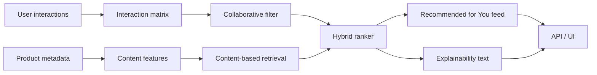

# Architecture

The first version of the project should keep the pipeline simple:
- ingest user-item events and product metadata
- train collaborative and content-based models separately
- merge scores in a hybrid ranker
- expose ranked results through FastAPI or Streamlit
