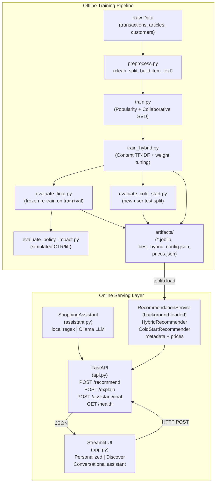
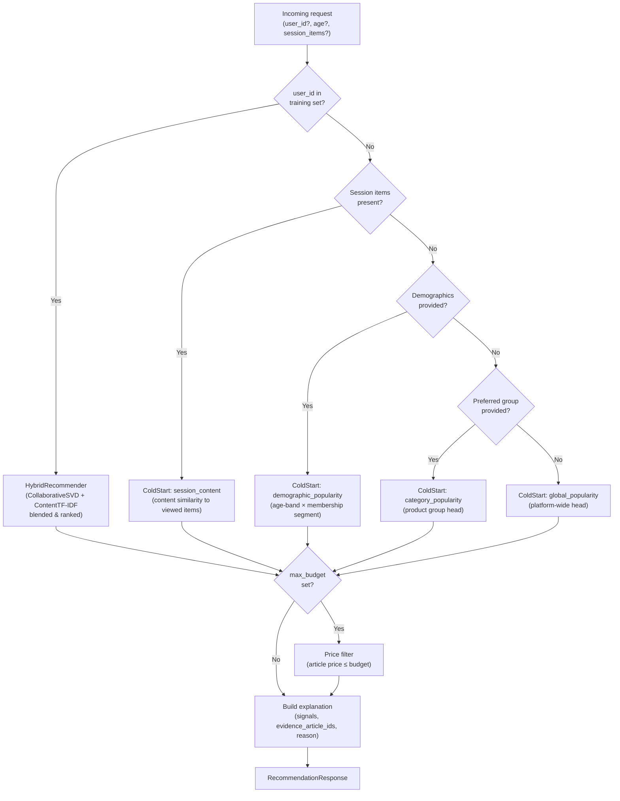
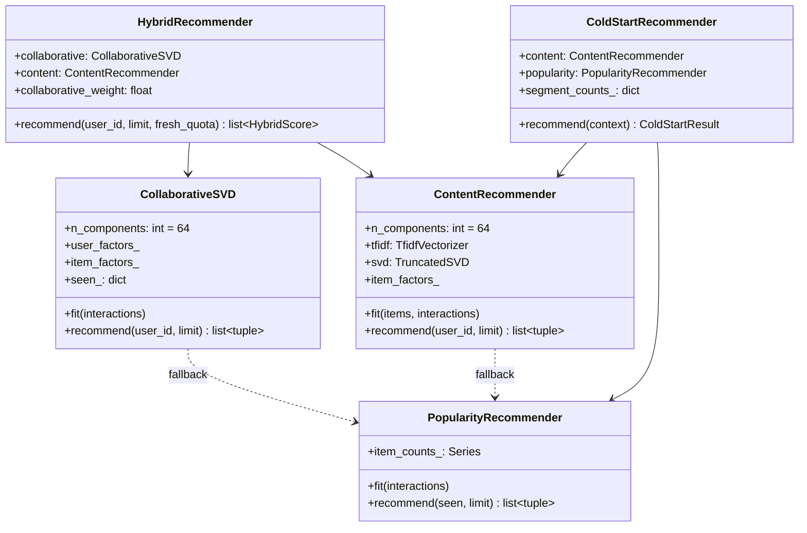

# Architecture

## System Overview

Reco-Nova is a personalized product recommendation engine for fashion retail
(H&M dataset). It combines collaborative filtering, content-based retrieval,
and a conversational assistant into a single FastAPI service, exposed through
a Streamlit UI.

## High-Level Component Diagram



## Request Routing Diagram



## Model Composition



## Hybrid Ranking Implementation

Product metadata is represented with word/bigram TF-IDF compressed to 64 SVD
components. A user's content profile is the normalized, confidence-weighted
centroid of the product factors for all items in their training history —
repeat purchases receive higher weight.

Collaborative SVD and content retrieval each produce a candidate pool of
`10 × limit` items. Scores are min-max normalized per request, then blended:

```text
hybrid_score = cf_weight × normalized_cf_score
             + (1 − cf_weight) × normalized_content_score
```

The weight is tuned on the validation split by grid-search over {0.25, 0.50,
0.75}, selecting the value that maximizes NDCG@K (MAP@K and Hit Rate@K as
deterministic tie-breakers). The best weight found is stored in
`artifacts/hybrid/best_hybrid_config.json` and loaded at serve time.

Previously purchased items are excluded before ranking. Warm-start benchmarks
restrict every model to the catalog observed during training; fresh-item
exposure is measured separately to avoid future-catalog leakage.
