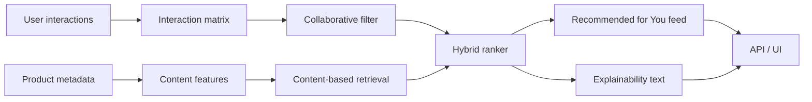

# Architecture



The first version of the project should keep the pipeline simple:
- ingest user-item events and product metadata
- train collaborative and content-based models separately
- merge scores in a hybrid ranker
- expose ranked results through FastAPI or Streamlit

## Hybrid ranking implementation

The current offline pipeline represents product metadata with word/bigram
TF-IDF and randomized truncated SVD. A user's content profile is the normalized,
repeat-purchase-weighted centroid of products in their training history.

Collaborative SVD and content retrieval each generate a larger candidate pool.
Their scores are min-max normalized within the user request, then combined as:

```text
hybrid_score = cf_weight * normalized_cf_score
             + (1 - cf_weight) * normalized_content_score
```

Validation evaluates configured weights and selects the best by NDCG@K, using
MAP@K and Hit Rate@K as deterministic tie-breakers. Previously purchased items
are excluded before ranking. The warm-start comparison restricts every model to
the catalog observed in training. Searching brand-new catalog items is evaluated
separately by the cold-start and multimodal milestones, avoiding future-catalog
leakage in the hybrid benchmark.
