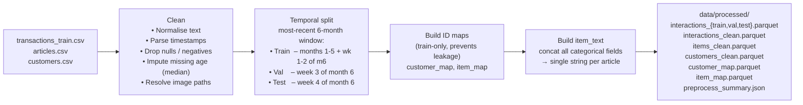
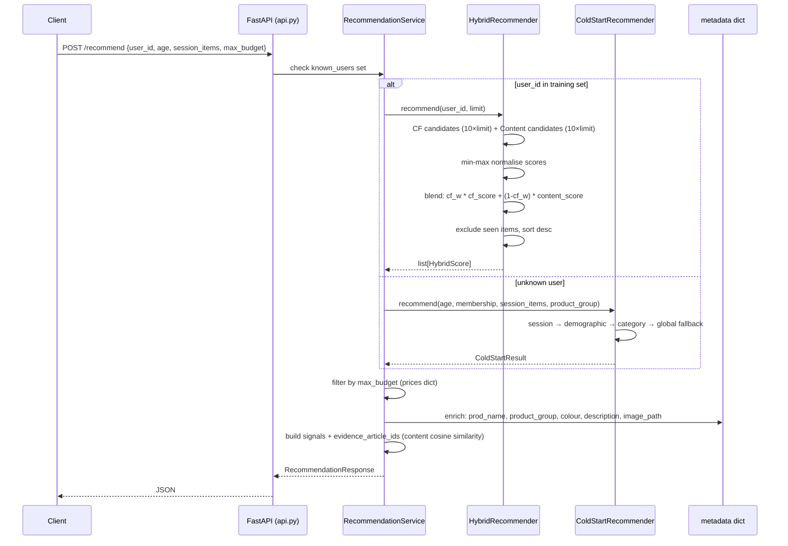

# Data Flow: Ingestion to Ranking

## 1. Raw Data Sources

| File | Rows (approx.) | Key Columns |
|---|---|---|
| `transactions_train.csv` | ~31M | customer_id, article_id, t_dat, price, sales_channel_id |
| `articles.csv` | ~105K | article_id, prod_name, product_type_name, product_group_name, colour_group_name, detail_desc |
| `customers.csv` | ~1.4M | customer_id, FN, Active, club_member_status, fashion_news_frequency, age |
| `images/` | ~105K | JPEG product photos, keyed by article_id |

---

## 2. Preprocessing (`preprocess.py`)



**Scale after preprocessing:**  
~7.8M train interactions · ~930K val · ~250K test  
49,882 articles with price data in `artifacts/prices.json`

---

## 3. Baseline Training (`train.py`)

```
interactions_train.parquet
    │
    ├─► PopularityRecommender.fit()
    │       count interactions per article, rank by frequency
    │       → artifacts/popularity.joblib
    │
    └─► CollaborativeSVD.fit()
            build sparse user-item matrix (log-scale confidence)
            TruncatedSVD(n_components=64)
            → artifacts/collaborative_svd.joblib
            → artifacts/baseline_metrics.json
```

---

## 4. Hybrid Training (`train_hybrid.py`)

```
interactions_train.parquet + items_clean.parquet
    │
    ├─► ContentRecommender.fit()
    │       TF-IDF(ngram_range=(1,2)) on item_text
    │       TruncatedSVD(n_components=64) compression
    │       user profile = weighted centroid of seen item factors
    │       → artifacts/hybrid/content_tfidf.joblib
    │
    ├─► Retrain PopularityRecommender + CollaborativeSVD
    │       → artifacts/hybrid/{popularity,collaborative_svd}.joblib
    │
    └─► Weight tuning (grid-search: 0.25, 0.50, 0.75)
            evaluate each weight on validation users by NDCG@K
            → artifacts/hybrid/best_hybrid_config.json
            → artifacts/hybrid/hybrid_metrics.json
```

---

## 5. Final Evaluation (`evaluate_final.py`)

```
interactions_train.parquet + interactions_val.parquet (combined)
    │
    ├─► Re-train all models on train+val (frozen configuration)
    │       → artifacts/final/{collaborative_svd,content_tfidf,popularity}.joblib
    │
    └─► Evaluate on warm-start test users
            metrics: NDCG@K, MAP@K, Hit Rate@K, Catalog Coverage@K
            95% bootstrap CIs (1,000 resamples)
            → artifacts/final/final_evaluation.json
```

---

## 6. Cold-Start Evaluation (`evaluate_cold_start.py`)

```
interactions_train.parquet + interactions_val.parquet (combined)
    │
    ├─► Train ContentRecommender + ColdStartRecommender
    │       segment_counts keyed by (age_band, club_member_status)
    │       → artifacts/cold_start/cold_start.joblib
    │
    └─► Evaluate on NEW test users (absent from train+val)
            strategies: global_popularity vs demographic_popularity
            → artifacts/cold_start/cold_start_metrics.json
```

---

## 7. Serving / Online Ranking Flow



---

## 8. Price Catalog Population

```
On first startup (if artifacts/prices.json absent):
    data/processed/interactions_train.parquet
        → group by article_id
        → median(price) × 1000   # normalised raw values → approx USD
        → round to integer
        → write artifacts/prices.json  (822 KB, 49,882 articles)

On subsequent startups:
    artifacts/prices.json  →  loaded directly (skip parquet read)
```

The ×1000 factor converts the normalised price column (range ~0.004–0.7)
to a USD-like scale. It is a proxy only; the actual H&M catalogue prices
are not published.

---

## 9. Artifact Inventory

| Path | Contents | Produced by |
|---|---|---|
| `artifacts/popularity.joblib` | PopularityRecommender | train.py |
| `artifacts/collaborative_svd.joblib` | CollaborativeSVD | train.py |
| `artifacts/baseline_metrics.json` | NDCG/MAP/HR on val | train.py |
| `artifacts/hybrid/` | All three models + weight config + metrics | train_hybrid.py |
| `artifacts/final/` | Re-trained models + final_evaluation.json | evaluate_final.py |
| `artifacts/cold_start/` | ColdStartRecommender + metrics | evaluate_cold_start.py |
| `artifacts/policy_impact/` | policy_impact_report.json | evaluate_policy_impact.py |
| `artifacts/prices.json` | Median price per article (USD-like) | api.py (lazy) |
