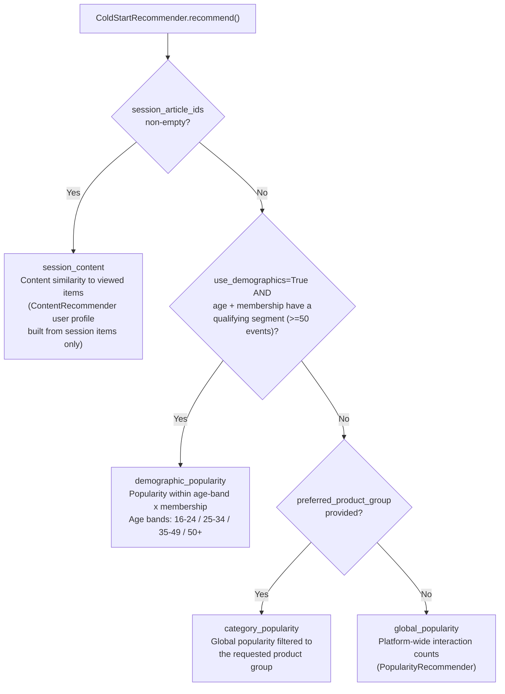

# Cold-Start Strategy and Recommendation Explainability

## Cold-Start Paths

New users — those absent from the training and validation sets — cannot receive
collaborative or content recommendations because no behavioral history exists.
`ColdStartRecommender` selects among four fallback strategies in priority order:



### Strategy details

| Strategy | Signal used | `signals` field value |
|---|---|---|
| `session_content` | Content cosine similarity to viewed session items | `{"session_content": 1.0}` |
| `demographic_popularity` | Interaction frequency within age-band x membership cell | `{"demographic_popularity": 1.0}` |
| `category_popularity` | Interaction frequency within preferred product group | `{"category_popularity": 1.0}` |
| `global_popularity` | Platform-wide interaction frequency | `{"global_popularity": 1.0}` |

No behavioral history is invented for anonymous users. The `reason` field names
the fallback strategy rather than claiming a past interaction.

### Cold-start offline performance

Evaluated on held-out new users from the final test week:

| Strategy | NDCG@12 | Notes |
|---|---|---|
| `global_popularity` | 0.0056 | Baseline |
| `demographic_popularity` | 0.0057 | Marginal lift; segment size often too small |

The small gap reflects sparse demographic data and the inherent difficulty of
recommending without behavioral history.

---

## Personalized User Explainability

For users present in the training set, every recommendation carries grounded
evidence derived from model inputs and scores, not generated claims.

### `signals` field

```json
"signals": {
  "collaborative": 0.63,
  "content": 0.21
}
```

- `collaborative`: the normalized collaborative contribution after the hybrid
  weight is applied (`cf_weight * normalized_cf_score`).
- `content`: the normalized content contribution
  (`(1 - cf_weight) * normalized_content_score`).

Both values are request-local min-max normalized scores — they are ranking
evidence, not probabilities. A zero value means that source did not place the
product in its candidate pool for this request.

### `evidence_article_ids` and `reason`

The evidence item is the user's training-history product with the greatest
cosine similarity to the recommendation in the shared 64-dimensional content
factor space:

```python
# _closest_history_item() in api.py
target = content.item_factors_[target_index]
return max(eligible, key=lambda pair: content.item_factors_[pair[1]] @ target)
```

The `reason` field is composed as:

```
"Because you interacted with {evidence_product_name}"
```

If the evidence item's catalog name is unavailable, the article ID is used
instead. The evidence article ID is always included in `evidence_article_ids`
for independent verification.

---

## Explanation Coverage by Strategy

| Strategy | `signals` keys | `evidence_article_ids` | `reason` text |
|---|---|---|---|
| `hybrid` | `collaborative`, `content` | 1 item (closest history match) | "Because you interacted with X" |
| `session_content` | `session_content: 1.0` | session items used | Names viewed item |
| `demographic_popularity` | `demographic_popularity: 1.0` | `[]` | Strategy name only |
| `category_popularity` | `category_popularity: 1.0` | `[]` | Strategy name only |
| `global_popularity` | `global_popularity: 1.0` | `[]` | Strategy name only |
| `catalog_text_search` | `catalog_text_search: 1.0` | `[]` | "Popular catalog products matching ..." |

---

## API Explainability Endpoints

Both `POST /recommend` and `POST /explain` return the same `RecommendationResponse`
schema including all explanation fields. The dedicated `/explain` endpoint exists
for clients that want to make the explanation interaction explicit while retaining
a consistent response schema.

Explanation evidence is covered by unit tests, API integration tests, and
real-artifact smoke tests in the test suite.

---

## Budget Constraint Transparency

When a `max_budget` is provided:

1. Price is looked up from `artifacts/prices.json` (median transaction price x1000).
2. Items whose price exceeds the budget are removed from the candidate list.
3. The `colour` field shows `~$N` to surface the approximate price to the client.
4. The assistant message includes `under $N` as an explicit qualifier.
5. If budget filtering removes all results, the system falls back to an
   unfiltered catalog text search and notes this in the `explanation` field.

The price values are derived from historical transaction medians and are
approximations — they are never presented as current retail prices.
